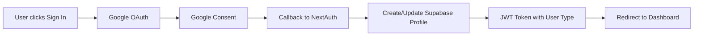

# 🔐 Rukna Authentication Implementation

## 🎉 Authentication System Complete!

Our NextAuth.js + Google OAuth + Supabase authentication system is now fully implemented with modern UI and user type management.

## ✅ What's Implemented

### **1. NextAuth.js Configuration**
- **Route Handler**: `src/app/api/auth/[...nextauth]/route.ts`
- **Google OAuth Provider**: Seamless Google sign-in
- **JWT Strategy**: Stateless authentication for performance
- **TypeScript Support**: Proper type definitions for user types

### **2. Supabase Integration**
- **Automatic Profile Creation**: Users created in `profiles` table on first sign-in
- **User Type Management**: Tourists vs Guides differentiation
- **Default Tourist Profiles**: New users start as tourists with default preferences
- **Database Sync**: Profile data synced with Google account info

### **3. Authentication Flow**


### **4. User Interface Components**
- **UserNav Component**: Smart navigation showing user status
- **Sign-in Page**: Beautiful, responsive authentication page
- **Error Handling**: Comprehensive error page with troubleshooting
- **User Dropdown**: Context-aware navigation based on user type
- **Loading States**: Smooth transitions and loading indicators

### **5. Type Safety**
- **NextAuth Types**: Extended session and user interfaces
- **User Types**: Tourist/Guide distinction throughout the app
- **TypeScript Support**: Full type checking for authentication

## 🗂️ File Structure

```
src/
├── app/
│   ├── api/auth/[...nextauth]/route.ts    # NextAuth configuration
│   └── auth/
│       ├── signin/page.tsx                # Sign-in page
│       └── error/page.tsx                 # Error handling
├── components/
│   ├── user-nav.tsx                       # User navigation component
│   └── session-provider.tsx              # Session context wrapper
├── types/
│   └── next-auth.d.ts                     # TypeScript definitions
└── lib/
    └── supabase.ts                        # Database integration
```

## 🔧 Environment Variables Required

```env
# NextAuth Configuration
NEXTAUTH_URL=http://localhost:3001
NEXTAUTH_SECRET=your_random_secret_here

# Google OAuth Credentials
GOOGLE_CLIENT_ID=123456789-abc.apps.googleusercontent.com
GOOGLE_CLIENT_SECRET=GOCSPX-abcdefghijklmnop

# Supabase (already configured)
NEXT_PUBLIC_SUPABASE_URL=your_supabase_url
NEXT_PUBLIC_SUPABASE_ANON_KEY=your_supabase_key
```

## 🚀 User Experience Flow

### **New User Registration**
1. **Clicks "I'm a Tourist" or "I'm a Local Guide"**
2. **Redirected to Google OAuth** with context
3. **Signs in with Google account**
4. **Profile automatically created** in Supabase
5. **Redirected to onboarding flow** (next phase)

### **Returning User**
1. **Clicks "Sign In"**
2. **Quick Google authentication**
3. **Redirected to appropriate dashboard** based on user type

### **Navigation Experience**
- **Signed Out**: "Sign In" and "Get Started" buttons
- **Tourist**: Shows "Tourist" badge, links to discovery and bookings
- **Guide**: Shows "Guide" badge, links to dashboard and experiences
- **All Users**: Profile dropdown with settings and sign out

## 🛡️ Security Features

### **Authentication Security**
- **Google OAuth 2.0**: Industry-standard authentication
- **JWT Tokens**: Stateless, secure session management
- **CSRF Protection**: Built-in NextAuth.js protection
- **Secure Callbacks**: Validated redirect URLs

### **Database Security**
- **Row Level Security**: Only authenticated users can access data
- **User Isolation**: Users can only see their own profiles
- **Type Validation**: User types enforced at database level
- **Audit Trail**: Created/updated timestamps on all records

### **Frontend Security**
- **Protected Routes**: Authentication required for sensitive pages
- **Type Checking**: User type validation in components
- **Error Boundaries**: Graceful handling of auth failures
- **Session Validation**: Real-time session status checking

## 🎯 User Type System

### **Tourist Profile** (Default)
```typescript
{
  user_type: 'tourist',
  interests: [],
  budget_range: 'moderate',
  group_size_preference: 2,
  activity_level: 'medium'
}
```

### **Guide Profile** (Manual Conversion)
```typescript
{
  user_type: 'guide',
  specialties: [],
  languages_spoken: ['Arabic'],
  verification_status: 'pending',
  is_active: true
}
```

## 📱 Mobile-First Design

### **Responsive Authentication**
- **Mobile-optimized sign-in page**
- **Touch-friendly buttons and inputs**
- **Readable text and proper spacing**
- **Fast loading on mobile networks**

### **Progressive Enhancement**
- **Works without JavaScript** (basic OAuth flow)
- **Enhanced with JavaScript** (smooth transitions)
- **Offline graceful degradation**

## 🔍 Testing Strategy

### **Authentication Testing**
```bash
# Test sign-in flow
1. Click "Sign In" → Should redirect to Google
2. Complete OAuth → Should redirect back to app
3. Check user appears in navigation
4. Verify profile created in Supabase

# Test user types
1. Sign in as tourist → Should show tourist badge
2. Convert to guide → Should show guide options
3. Sign out → Should clear session
4. Sign back in → Should remember user type
```

### **Error Testing**
```bash
# Test error scenarios
1. Invalid OAuth callback → Should show error page
2. Supabase connection failure → Should handle gracefully
3. Invalid user type → Should default to tourist
4. Network errors → Should show retry options
```

## 🚦 Next Steps Ready

With authentication complete, we're ready for:

### **Immediate Next (Hours 2-4)**
1. **Onboarding Flows**: Tourist and guide profile setup
2. **Interest Selection**: Interactive interest/specialty picker
3. **Profile Completion**: Required fields for full profiles

### **Following Phases**
1. **AI Matching**: Semantic similarity between users
2. **Experience Management**: Guides create offerings
3. **Booking System**: End-to-end booking flow
4. **Messaging**: Real-time chat between users

## 🎭 Demo-Ready Features

### **For Judges/Stakeholders**
- ✅ **Professional UI**: Modern, sleek authentication
- ✅ **Google Integration**: Familiar sign-in experience
- ✅ **Instant Access**: No complex registration forms
- ✅ **User Types**: Clear distinction between tourists/guides
- ✅ **Error Handling**: Graceful failure modes

### **Technical Highlights**
- ✅ **Modern Stack**: NextAuth.js + Supabase + TypeScript
- ✅ **Security First**: OAuth 2.0 + RLS + JWT
- ✅ **Performance**: Stateless authentication
- ✅ **Scalable**: Database-driven user management
- ✅ **Type Safe**: Full TypeScript coverage

## 📋 Setup Checklist

To use the authentication system:

- [ ] **Follow `GOOGLE_OAUTH_SETUP.md`** to configure Google OAuth
- [ ] **Add environment variables** from `.env.example`
- [ ] **Test sign-in flow** with your Google account
- [ ] **Verify profile creation** in Supabase dashboard
- [ ] **Ready for onboarding development!**

**🎉 Authentication is complete and demo-ready!** The foundation is solid for building the rest of the Rukna platform. Users can now seamlessly sign in and we can track their type (tourist vs guide) throughout the app.

**Ready to continue with user profiles and onboarding?** 🚀